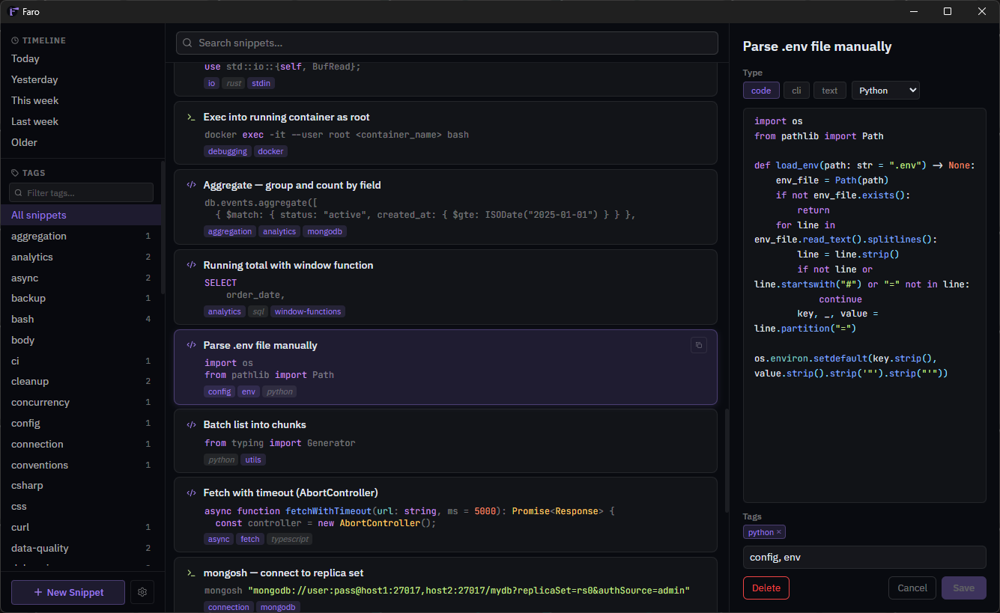
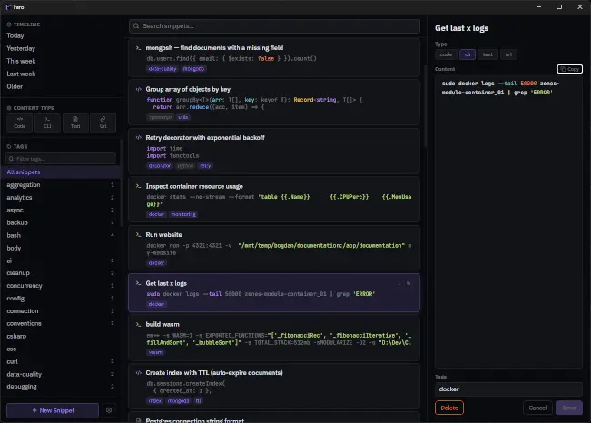
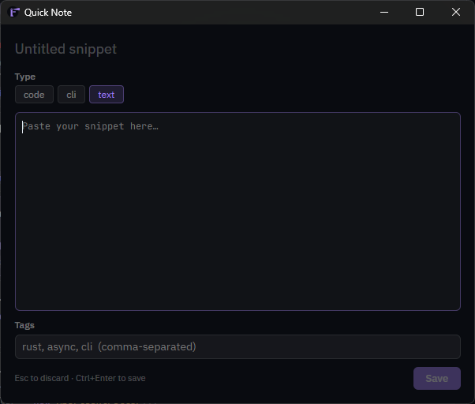

# Faro

> *A lighthouse for your knowledge. Local-first snippet and knowledge management for developers.*

Faro is a desktop app for capturing, organizing, and retrieving developer snippets: code, CLI commands, and notes. The core philosophy is **dump-first, organize-later**: zero friction on capture, smart retrieval when you need it.

Built with Tauri v2 + Svelte 5.

---

## Philosophy

- **Dump first, organize later.** Capture friction kills the habit. Retrieval is the product.
- **Local-first.** Your snippets live on your machine. No accounts, no cloud, no sync.
- **Intentional minimalism.** Every feature cut is a feature that doesn't need maintaining.

---

## Features

### Quick Note
Global hotkey (`Ctrl+Shift+Space` by default) opens a focused floating window — anywhere, anytime, even when Faro's main window isn't focused. Paste your snippet, add a title and tags, save. It auto-detects the content type and language on save. No mode-switching, no navigation, no friction.

### Full-Text Search
FTS5-powered search across all snippet titles and content. Results update as you type. 

### Auto Content Detection
highlight.js inspects content on save and automatically classifies it as `code`, `cli`, or `text`, plus detects the specific language (Rust, Python, bash, SQL, etc.) and creates system tags. You can override the type manually.

### Three-Panel Layout


**Left panel** — timeline navigation, tag browser with inline filter, new snippet button, settings access.

**Center panel** — full-text search bar, snippet list with type icons and 2-line previews, tag chips (user tags and auto-detected language tags are visually distinct).

**Right panel** — snippet content, directly editable in place. Explicit save keeps accidental edits from destroying data.

### Tag System
Two tag sources coexist on each snippet:
- **User tags**: whatever you type in the tags field
- **System tags**: auto-detected language labels (e.g. `rust`, `python`, `bash`)

Both are browsable from the left panel. Clicking a tag filters the center panel to matching snippets.

### Themes
Dark (default), Light, and Nord.


---

## Keyboard Shortcuts

### Main Window

| Shortcut | Action |
|---|---|
| `Ctrl+F` | Focus the search bar |
| `Ctrl+N` | New snippet |
| `↑` / `↓` | Navigate the snippet list |

### Quick Note Window

| Shortcut | Action |
|---|---|
| `Ctrl+Enter` | Save snippet |
| `Esc` | Discard and close |

### Global (system-wide)

| Shortcut | Action |
|---|---|
| `Ctrl+Shift+Space` | Open Quick Note (configurable) |

---

## Settings

Open via the gear icon in the bottom-left corner.

| Setting | Description |
|---|---|
| **Global hotkey** | The system-wide shortcut that opens Quick Note. Default: `Ctrl+Shift+Space`. |
| **Editor font size** | Code area font size, 10–24px. Previews live. |
| **Quick Note stay open** | When enabled, Quick Note clears and stays open after saving instead of closing. |
| **Theme** | Dark / Light / Nord. Previews live before saving. |

---

## Tech Stack

| Layer | Technology |
|---|---|
| Backend | Rust (Tauri v2) |
| Frontend | Svelte 5 + TypeScript |
| Database | SQLite via `rusqlite` + FTS5 |
| Language detection | highlight.js |
| UI font | IBM Plex Sans |
| Editor font | JetBrains Mono |

**Platform targets:** Windows (primary), Linux (secondary). No macOS.

---

## Building from Source

**Prerequisites:**

- [Rust toolchain](https://rustup.rs/) (stable)
- [Node.js](https://nodejs.org/) 18+
- [pnpm](https://pnpm.io/) (`npm install -g pnpm`)
- Tauri v2 system dependencies — see the [Tauri prerequisites guide](https://v2.tauri.app/start/prerequisites/) for your OS

**Install dependencies:**

```bash
pnpm install
```

**Run in development:**

```bash
pnpm tauri dev
```

**Build a release binary:**

```bash
pnpm tauri build
```

The installer/binary lands in `src-tauri/target/release/bundle/`.

---

## Name & Identity

**Faro** — Spanish/Portuguese for *lighthouse*. A reference tool that helps you find things. The purple accent aligns with dusk and lighthouse imagery, which is either a happy accident or destiny, depending on how dramatic you're feeling.

---

## License

[MIT](LICENSE)

